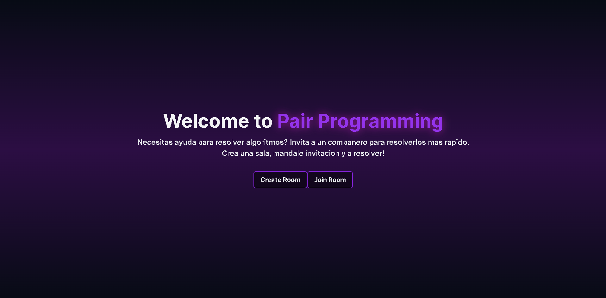
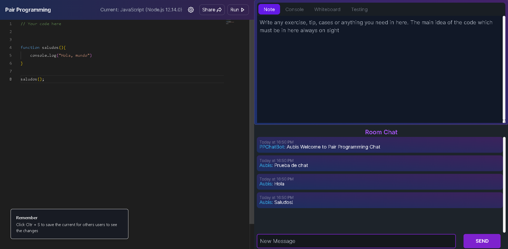
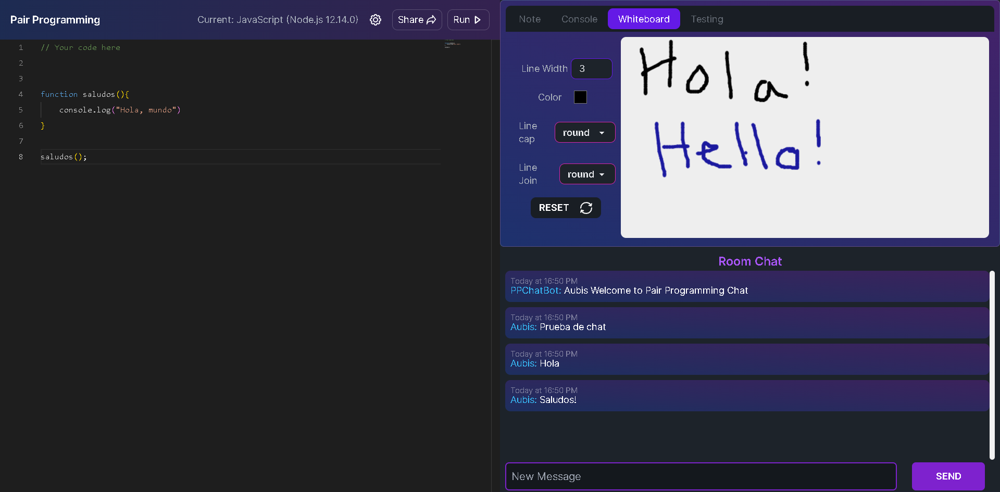

# Programming rooms

<!-- Improved compatibility of back to top link: See: https://github.com/othneildrew/Best-README-Template/pull/73 -->
<a name="readme-top"></a>
<!--
*** Thanks for checking out the Best-README-Template. If you have a suggestion
*** that would make this better, please fork the repo and create a pull request
*** or simply open an issue with the tag "enhancement".
*** Don't forget to give the project a star!
*** Thanks again! Now go create something AMAZING! :D
-->


<!-- PROJECT LOGO -->
<br />
<div align="center">
  <a href="[https://github.com/AubisDev/programming-rooms-client">
    
  </a>

<h3 align="center">Programming Rooms</h3>

  <p align="center">
    Solve coding problems with your friends. A Project created using Web Sockets
    <br />
    <a href="https://github.com/AubisDev/programming-rooms-client"><strong>Explore the docs »</strong></a>
    <br />
    <br />
    <a href="">Live demo unavailable, only locally</a>
    ·
    <a href="https://github.com/AubisDev/programming-rooms-client/issues">Request Feature</a>
  </p>
</div>


<!-- TABLE OF CONTENTS -->
<details>
  <summary>Table of Contents</summary>
  <ol>
    <li>
      <a href="#about-the-project">About The Project</a>
      <ul>
        <li><a href="#built-with">Built With</a></li>
      </ul>
    </li>
    <li>
      <a href="#getting-started">Getting Started</a>
      <ul>
        <li><a href="#prerequisites">Prerequisites</a></li>
        <li><a href="#installation">Installation</a></li>
      </ul>
    </li>
    <li><a href="#contact">Contact</a></li>
  </ol>
</details>


### Built With

* [![NextJS][NextJS]][Nextjs-url]
* [![Tailwind CSS][Tailwind_css]][tailwind_url]
* [![Typescript][Typescript]][Typescript_url]
* [![ContextAPI][ContextAPI]][Context_url]
* [![Monaco-editor][Monaco-editor]][Monaco-editor_url]
* [![Socket.io][Socket.io]][Socketio_url]
* [![Axios][Axios]][Axios_url]
* [![Re-resizable][Re-resizable]][Resizable_url]
* [![Sonner][Sonner]][Sonner_url]


<p align="right">(<a href="#readme-top">back to top</a>)</p>


<!-- GETTING STARTED -->
## Getting Started
  ```sh
  Clone the repository
  ```
 
* How to install 

  ```
   cd programming-rooms-client
  ```
  
* yarn
  ```sh
  yarn install
  //or
  pnpm install 
  ```
  
  ```sh
  yarn dev
  //or
  pnpm dev
  ```

<p align="right">(<a href="#readme-top">back to top</a>)</p>


<!-- APP IMAGES -->
## LIVE PAGE IMAGES

Categories section


Room page


Room page with whiteboard



<!-- CONTACT -->
## Contact

Aubis Sanchez -  - aubisdev@gmail.com

Project Link: [https://github.com/AubisDev/programming-rooms-client](https://github.com/AubisDev/programming-rooms-client)

<p align="right">(<a href="#readme-top">back to top</a>)</p>


<!-- MARKDOWN LINKS & IMAGES -->
<!-- https://www.markdownguide.org/basic-syntax/#reference-style-links -->

[NextJS]: https://img.shields.io/badge/Nextjs-35495E?style=for-the-badge&logo=react&logoColor=61DAFB
[Nextjs-url]: [https://nextjs.org/
[Tailwind_css]: https://img.shields.io/badge/Tailwind%20CSS-35495E?style=for-the-badge&logo=materialui&logoColor=61DAFB
[Tailwind_url]: https://tailwindcss.com/
[Typescript]: https://img.shields.io/badge/Typescript-35495E?style=for-the-badge&logo=typescript&logoColor=61DAFB
[Typescript_url]: https://www.typescriptlang.org/
[ContextAPI]: https://img.shields.io/badge/ContextAPI-35495E?style=for-the-badge&logo=redux&logoColor=61DAFB
[Context_url]: https://react.dev/reference/react/createContext
[Monaco-Editor]: https://img.shields.io/badge/Monaco%20Editor-35495E?style=for-the-badge&logo=react-router&logoColor=61DAFB
[Monaco-editor_url]: https://microsoft.github.io/monaco-editor/
[Axios]: https://img.shields.io/badge/Axios-35495E?style=for-the-badge&logo=formik&logoColor=61DAFB
[Axios_url]: https://axios-http.com/docs/intro
[Re-resizable]: https://img.shields.io/badge/Re-Resizable-35495E?style=for-the-badge&logo=yup&logoColor=61DAFB
[Resizable_url]: https://www.npmjs.com/package/re-resizable
[main-page_img]: public/mainpage.webp
[mobile-view_img]: public/mobile_view.webp
[Sonner]: https://img.shields.io/badge/Sonner-35495E?style=for-the-badge&logo=firebase&logoColor=61DAFB
[Sonner_url]: https://sonner.emilkowal.ski/
[Socket.io]: https://img.shields.io/badge/Socket.io-35495E?style=for-the-badge&logo=firebase&logoColor=61DAFB
[Socketio_url]:https://socket.io/
